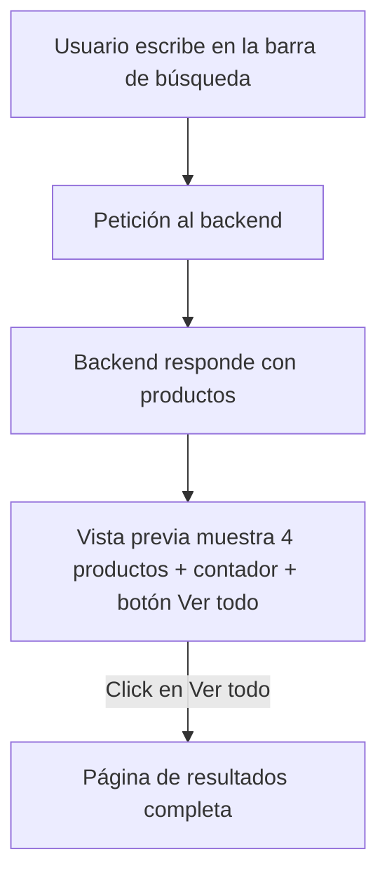

# 🛒 E-commerce Catálogo - Resumen de Cambios y Mejoras

## 1. 🛠️ Búsqueda Avanzada y Vista Previa Flotante

- Implementación de un panel de búsqueda flotante que aparece justo debajo del header, ocupando todo el ancho de la pantalla.
- El panel muestra:
  - Un campo de búsqueda con icono y botón de cerrar integrado.
  - Resultados en tiempo real mientras el usuario escribe.
  - Un contador de resultados (ej: `10 resultados`) y un botón/enlace **"Ver todo"** para acceder a la página completa de resultados.
  - Solo los **4 primeros productos** en la vista previa, con scroll vertical propio y fondo blanco en la barra lateral.
- Bloqueo del scroll de la página de fondo mientras el panel está abierto, para una experiencia de usuario más profesional.
- Uso de React Portal para renderizar el panel flotante fuera del flujo del header, asegurando stacking y scroll correctos.

---

## 2. 📄 Página de Resultados de Búsqueda

- Página dedicada que muestra **todos los productos** que coinciden con la búsqueda, sin recorte.
- Visualización consistente con el resto de la tienda: grid de productos, contador de resultados y navegación clara.
- Botón "Volver" para regresar fácilmente a la página anterior.

---

## 3. 🗂️ Páginas de Categoría Mejoradas

- Todas las páginas de categoría (Hombres, Mujeres, Pantalones, etc.) muestran solo los **4 primeros productos** por defecto.
- Se añade un botón **"Ver todo"** debajo del grid, que al hacer clic muestra todos los productos de la categoría.
- Grid de productos responsivo y visualmente atractivo, con tarjetas de producto uniformes.

---

## 4. 🎨 Consistencia Visual y Experiencia de Usuario

- Scroll vertical personalizado en la vista previa de búsqueda, con fondo blanco y sin scroll horizontal.
- Eliminación de márgenes y paddings innecesarios para un diseño limpio y moderno.
- Colores, tipografías y botones coherentes en toda la aplicación.
- Mensajes claros de carga y error en todas las páginas de productos.

---

## 5. ⚙️ Backend y Lógica de Búsqueda

- El backend permite búsquedas por nombre de categoría, devolviendo todos los productos que coincidan (sin importar el género).
- Si existen categorías duplicadas (ej: "Pantalones" para hombres y mujeres), la búsqueda global suma los productos de ambas.
- Se documentó la posibilidad de filtrar por género si se requiere en el futuro.

---

## 6. 📚 Documentación y Buenas Prácticas

- Código comentado y estructurado para facilitar el mantenimiento y futuras ampliaciones.
- Uso de hooks de React (`useState`, `useEffect`) para la gestión de estado y efectos secundarios.
- Separación clara entre lógica de negocio, presentación y estilos.

---

## 7. 💡 UX/UI Detalles Destacados

- Panel de búsqueda flotante con efecto de elevación y scroll propio.
- Botón de cerrar siempre visible y accesible.
- Grid de productos sin desbordes ni barras de scroll innecesarias.
- Visualización clara del número de resultados y acceso rápido a la vista completa.

---

## 🖼️ Ejemplo de Vista Previa de Búsqueda

> _Aquí puedes añadir una captura de pantalla de la vista previa flotante de búsqueda mostrando productos y scroll lateral blanco._

```

```

---

## 🔄 Diagrama de Flujo de la Búsqueda



---

## 👨‍💻 Créditos

- Desarrollo Frontend: [Tu Nombre]
- Backend/API: [Tu Nombre o Equipo]
- Diseño UX/UI: [Tu Nombre o Equipo]

---

## 🚀 Futuras Mejoras

- Filtro por género en la búsqueda avanzada.
- Paginación en la página de resultados.
- Mejoras de accesibilidad (a11y).
- Animaciones adicionales y feedback visual.

---

